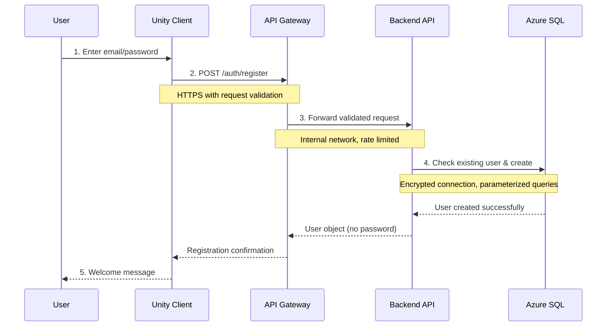
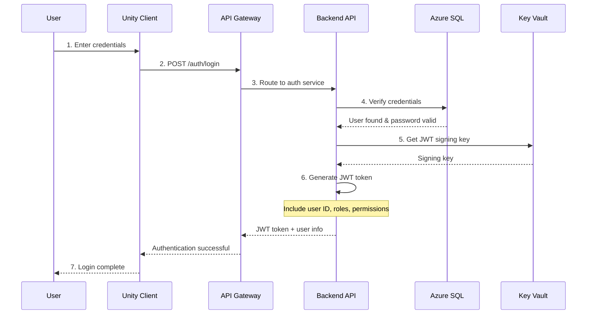
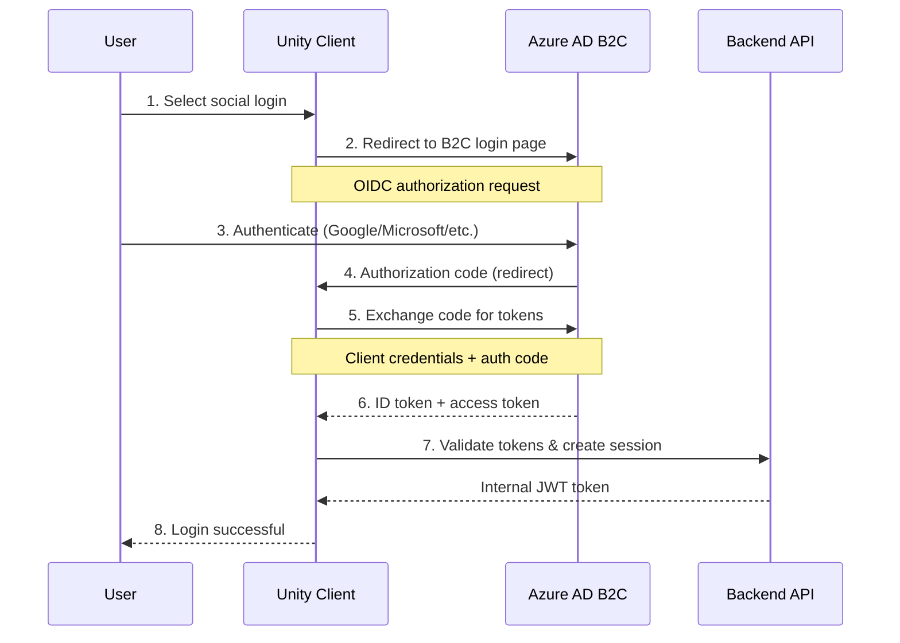
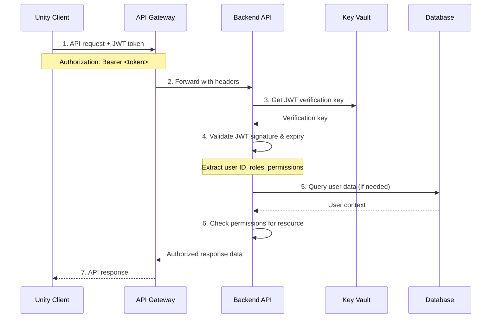
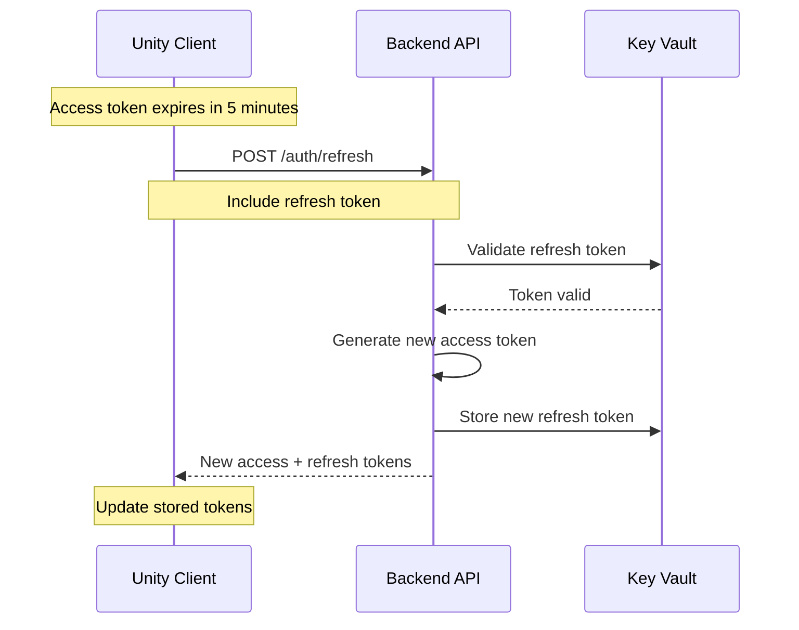

# CortexAI Authentication & Authorization Flow

## Overview

This document details the authentication and authorization mechanisms used in the CortexAI platform, including JWT token management, Azure AD B2C integration, and role-based access control.

## Authentication Architecture

### 1. Multi-Modal Authentication Support

The CortexAI platform supports multiple authentication methods:

1. **Direct Registration/Login**: Email and password with JWT tokens
2. **Azure AD B2C OIDC**: Social logins and enterprise integration
3. **Token-based API Access**: JWT bearer tokens for API calls

### 2. Security Principles

- **Zero Trust Architecture**: Verify every request
- **Principle of Least Privilege**: Minimal required permissions
- **Defense in Depth**: Multiple security layers
- **Compliance First**: HIPAA, GDPR, and healthcare regulations

## Authentication Flows

### User Registration Flow



**Security Features:**
- Password hashing with bcrypt (cost factor 12)
- Email uniqueness validation
- Input sanitization and validation
- Rate limiting (5 registrations per IP per hour)
- CAPTCHA integration for bot protection

### JWT Authentication Flow



**JWT Token Structure:**
```json
{
  "header": {
    "alg": "HS256",
    "typ": "JWT"
  },
  "payload": {
    "sub": "user-123",
    "email": "user@example.com",
    "iat": 1706356800,
    "exp": 1706360400,
    "roles": ["patient"],
    "permissions": ["read:own_sessions", "write:own_sessions"],
    "device_id": "device-fingerprint-hash"
  },
  "signature": "HMACSHA256(...)"
}
```

**Token Security:**
- 60-minute expiration for access tokens
- Secure random signing key from Azure Key Vault
- Device fingerprinting for session validation
- Automatic key rotation every 90 days

### Azure AD B2C OIDC Flow



**OIDC Configuration:**
- **Client ID**: Registered in Azure AD B2C
- **Redirect URI**: Deep link back to Unity app
- **Scopes**: `openid profile email offline_access`
- **Response Type**: `code` (authorization code flow)
- **PKCE**: Enabled for mobile security

### Protected API Access Flow



**Authorization Checks:**
1. **Token Validation**: Signature, expiry, format
2. **User Context**: Extract user ID and roles from token
3. **Resource Permissions**: Check if user can access specific resource
4. **Data Filtering**: Return only data user is authorized to see

## Role-Based Access Control (RBAC)

### User Roles

#### Patient Role
```json
{
  "role": "patient",
  "permissions": [
    "read:own_profile",
    "write:own_profile",
    "read:own_sessions",
    "write:own_sessions",
    "read:own_activities",
    "write:own_activities"
  ],
  "restrictions": [
    "Cannot access other users' data",
    "Cannot modify system configuration",
    "Cannot access raw analytics data"
  ]
}
```

#### Therapist Role
```json
{
  "role": "therapist",
  "permissions": [
    "read:assigned_patients",
    "write:patient_notes",
    "read:patient_sessions",
    "read:aggregated_analytics",
    "write:treatment_plans"
  ],
  "restrictions": [
    "Access limited to assigned patients only",
    "Cannot access system administration",
    "Cannot export raw patient data"
  ]
}
```

#### Admin Role
```json
{
  "role": "admin",
  "permissions": [
    "read:all_users",
    "write:system_config",
    "read:all_analytics",
    "write:user_roles",
    "read:audit_logs"
  ],
  "restrictions": [
    "Cannot access patient clinical data without specific authorization",
    "All actions logged and audited",
    "Requires MFA for sensitive operations"
  ]
}
```

#### Analyst Role
```json
{
  "role": "analyst",
  "permissions": [
    "read:aggregated_analytics",
    "read:anonymized_data",
    "write:reports",
    "read:system_metrics"
  ],
  "restrictions": [
    "No access to individual patient data",
    "Cannot modify system configuration",
    "Read-only access to most resources"
  ]
}
```

### Permission Implementation

#### FastAPI Dependency Injection
```python
from functools import wraps
from fastapi import Depends, HTTPException, status
from fastapi.security import HTTPBearer

security = HTTPBearer()

def require_permission(permission: str):
    def decorator(func):
        @wraps(func)
        async def wrapper(*args, **kwargs):
            token = kwargs.get('token')
            user = await get_current_user(token)
            
            if not has_permission(user, permission):
                raise HTTPException(
                    status_code=status.HTTP_403_FORBIDDEN,
                    detail=f"Insufficient permissions: {permission}"
                )
            
            return await func(*args, **kwargs)
        return wrapper
    return decorator

@app.get("/sessions/")
@require_permission("read:own_sessions")
async def get_sessions(current_user: User = Depends(get_current_user)):
    # Implementation
    pass
```

#### Resource-Level Authorization
```python
def check_resource_access(user: User, resource_type: str, resource_id: str) -> bool:
    """Check if user can access specific resource"""
    
    if resource_type == "session":
        session = get_session(resource_id)
        return session.user_id == user.id or user.role in ["therapist", "admin"]
    
    elif resource_type == "user_profile":
        return resource_id == str(user.id) or user.role in ["therapist", "admin"]
    
    elif resource_type == "analytics":
        return user.role in ["analyst", "admin"]
    
    return False
```

## Token Management

### Access Token Lifecycle

1. **Generation**: Created upon successful authentication
2. **Storage**: Secure storage in Unity client (encrypted PlayerPrefs)
3. **Usage**: Included in Authorization header for API calls
4. **Refresh**: Automatic refresh 5 minutes before expiry
5. **Revocation**: Server-side revocation on logout or security event

### Refresh Token Strategy



**Refresh Token Security:**
- 30-day expiration with sliding window
- One-time use (rotation on each refresh)
- Secure random generation (256-bit entropy)
- Revocation list for compromised tokens

### Session Management

#### Concurrent Session Handling
- **Limit**: Maximum 3 active sessions per user
- **Detection**: Device fingerprinting and IP tracking
- **Policy**: Oldest session terminated when limit exceeded
- **Notification**: User alerted of new device login

#### Session Security Features
```python
class SessionSecurity:
    def validate_session(self, token: str, request: Request) -> bool:
        """Comprehensive session validation"""
        
        # 1. JWT signature and expiry validation
        payload = verify_jwt_token(token)
        
        # 2. Device fingerprint validation
        expected_device = payload.get('device_id')
        current_device = generate_device_fingerprint(request)
        if expected_device != current_device:
            raise SecurityException("Device mismatch")
        
        # 3. Geolocation validation (if enabled)
        if self.geo_validation_enabled:
            self.validate_geolocation(payload, request)
        
        # 4. Rate limiting check
        if self.is_rate_limited(payload['sub'], request.client.host):
            raise RateLimitException("Too many requests")
        
        # 5. Concurrent session check
        if self.count_active_sessions(payload['sub']) > MAX_SESSIONS:
            self.revoke_oldest_session(payload['sub'])
        
        return True
```

## Error Handling and Security

### Authentication Errors

#### Invalid Credentials (401 Unauthorized)
```json
{
  "error": "authentication_failed",
  "error_description": "Invalid email or password",
  "error_code": "AUTH_001",
  "retry_after": 60,
  "lockout_remaining": 3
}
```

#### Account Locked (423 Locked)
```json
{
  "error": "account_locked",
  "error_description": "Account locked due to multiple failed attempts",
  "error_code": "AUTH_002",
  "unlock_time": "2024-01-27T11:30:00Z",
  "contact_support": "support@cortexai.com"
}
```

#### Token Expired (401 Unauthorized)
```json
{
  "error": "token_expired",
  "error_description": "Access token has expired",
  "error_code": "AUTH_003",
  "refresh_required": true,
  "refresh_endpoint": "/auth/refresh"
}
```

### Authorization Errors

#### Insufficient Permissions (403 Forbidden)
```json
{
  "error": "insufficient_permissions",
  "error_description": "User does not have required permissions",
  "error_code": "AUTHZ_001",
  "required_permission": "read:patient_data",
  "user_permissions": ["read:own_sessions"]
}
```

### Security Monitoring

#### Failed Login Detection
```python
class SecurityMonitor:
    def track_failed_login(self, email: str, ip_address: str):
        """Track and respond to failed login attempts"""
        
        # Increment failure count
        failures = self.redis.incr(f"login_failures:{email}")
        self.redis.expire(f"login_failures:{email}", 3600)  # 1 hour window
        
        # Progressive lockout
        if failures >= 5:
            self.lock_account(email, duration=timedelta(hours=1))
            self.send_security_alert(email, "Account locked due to failed logins")
        
        # IP-based rate limiting
        ip_failures = self.redis.incr(f"ip_failures:{ip_address}")
        if ip_failures >= 20:
            self.block_ip(ip_address, duration=timedelta(hours=24))
```

#### Anomaly Detection
- **Unusual Login Times**: Outside normal user patterns
- **Geographic Anomalies**: Login from unexpected locations
- **Device Changes**: New device without proper verification
- **Permission Escalation**: Attempts to access unauthorized resources

## Implementation Details

### FastAPI Authentication Middleware

```python
from fastapi import FastAPI, Depends, HTTPException, status
from fastapi.security import HTTPBearer, HTTPAuthorizationCredentials
import jwt
from datetime import datetime, timedelta

app = FastAPI()
security = HTTPBearer()

async def get_current_user(credentials: HTTPAuthorizationCredentials = Depends(security)):
    """Extract and validate current user from JWT token"""
    
    try:
        # Decode JWT token
        payload = jwt.decode(
            credentials.credentials,
            get_jwt_secret(),
            algorithms=["HS256"]
        )
        
        # Validate expiration
        if datetime.fromtimestamp(payload['exp']) < datetime.utcnow():
            raise HTTPException(
                status_code=status.HTTP_401_UNAUTHORIZED,
                detail="Token expired"
            )
        
        # Get user from database
        user_id = payload.get("sub")
        user = await get_user_by_id(user_id)
        
        if not user:
            raise HTTPException(
                status_code=status.HTTP_401_UNAUTHORIZED,
                detail="User not found"
            )
        
        return user
        
    except jwt.InvalidTokenError:
        raise HTTPException(
            status_code=status.HTTP_401_UNAUTHORIZED,
            detail="Invalid token"
        )

def require_role(required_role: str):
    """Decorator to require specific role"""
    def decorator(func):
        @wraps(func)
        async def wrapper(*args, **kwargs):
            user = kwargs.get('current_user')
            if user.role != required_role and user.role != 'admin':
                raise HTTPException(
                    status_code=status.HTTP_403_FORBIDDEN,
                    detail=f"Role '{required_role}' required"
                )
            return await func(*args, **kwargs)
        return wrapper
    return decorator
```

### Unity Client Token Management

```csharp
public class AuthenticationManager : MonoBehaviour
{
    private string accessToken;
    private string refreshToken;
    private DateTime tokenExpiry;
    
    public async Task<bool> LoginAsync(string email, string password)
    {
        var loginData = new { email, password };
        var response = await PostAsync("/auth/login", loginData);
        
        if (response.IsSuccess)
        {
            var tokenData = JsonUtility.FromJson<TokenResponse>(response.Data);
            
            // Store tokens securely
            accessToken = tokenData.access_token;
            refreshToken = tokenData.refresh_token;
            tokenExpiry = DateTime.UtcNow.AddSeconds(tokenData.expires_in);
            
            // Encrypt and save to PlayerPrefs
            SaveTokensSecurely();
            
            // Schedule automatic refresh
            ScheduleTokenRefresh();
            
            return true;
        }
        
        return false;
    }
    
    public async Task<string> GetValidTokenAsync()
    {
        // Check if token needs refresh
        if (DateTime.UtcNow.AddMinutes(5) >= tokenExpiry)
        {
            await RefreshTokenAsync();
        }
        
        return accessToken;
    }
    
    private async Task RefreshTokenAsync()
    {
        var refreshData = new { refresh_token = refreshToken };
        var response = await PostAsync("/auth/refresh", refreshData);
        
        if (response.IsSuccess)
        {
            var tokenData = JsonUtility.FromJson<TokenResponse>(response.Data);
            accessToken = tokenData.access_token;
            refreshToken = tokenData.refresh_token;
            tokenExpiry = DateTime.UtcNow.AddSeconds(tokenData.expires_in);
            
            SaveTokensSecurely();
        }
        else
        {
            // Refresh failed, redirect to login
            await LogoutAsync();
            SceneManager.LoadScene("LoginScene");
        }
    }
}
```

### Azure AD B2C Configuration

#### User Flow Configuration
```json
{
  "userFlows": {
    "signUpSignIn": {
      "id": "B2C_1_signup_signin",
      "identityProviders": [
        "Local Account",
        "Google",
        "Microsoft",
        "Facebook"
      ],
      "userAttributes": [
        "Email Address",
        "Given Name",
        "Surname",
        "Display Name"
      ],
      "applicationClaims": [
        "Email Addresses",
        "Given Name",
        "Surname",
        "User's Object ID"
      ]
    },
    "profileEdit": {
      "id": "B2C_1_profile_edit",
      "userAttributes": [
        "Given Name",
        "Surname",
        "Display Name"
      ]
    },
    "passwordReset": {
      "id": "B2C_1_password_reset",
      "emailVerification": true,
      "customDomain": "auth.cortexai.com"
    }
  }
}
```

## Security Best Practices

### Token Security
1. **Short Expiration**: 60-minute access tokens
2. **Secure Storage**: Encrypted storage in Unity PlayerPrefs
3. **Automatic Refresh**: Silent refresh before expiry
4. **Revocation Support**: Server-side token blacklisting
5. **Device Binding**: Token tied to device fingerprint

### Network Security
1. **TLS 1.2+**: All communications encrypted
2. **Certificate Pinning**: Unity client validates server certificates
3. **Request Signing**: Optional HMAC signing for critical operations
4. **Rate Limiting**: Per-user and per-IP limits
5. **DDoS Protection**: Azure Front Door integration

### Data Protection
1. **Password Hashing**: bcrypt with salt rounds
2. **PII Encryption**: Column-level encryption in database
3. **Audit Logging**: All authentication events logged
4. **Data Minimization**: Only necessary claims in JWT
5. **Right to Erasure**: GDPR-compliant user deletion

## Compliance and Auditing

### HIPAA Compliance
- **Unique User Identification**: Each user has unique identifier
- **Automatic Logoff**: Sessions timeout after inactivity
- **Audit Controls**: All access logged with user identification
- **Integrity Controls**: Data integrity validation
- **Transmission Security**: End-to-end encryption

### GDPR Compliance
- **Lawful Basis**: Consent and legitimate interest documented
- **Data Minimization**: Only necessary data in tokens
- **Right to Access**: Users can export their authentication data
- **Right to Erasure**: Complete user deletion including tokens
- **Data Portability**: Authentication data export capability

### Audit Trail
```json
{
  "event_id": "auth-2024-01-27-001",
  "timestamp": "2024-01-27T10:30:15Z",
  "event_type": "authentication",
  "action": "login_success",
  "user_id": "user-123",
  "ip_address": "192.168.1.100",
  "user_agent": "Unity/2022.3 (Windows)",
  "device_fingerprint": "device-hash-456",
  "geolocation": {
    "country": "US",
    "region": "CA",
    "city": "San Francisco"
  },
  "additional_context": {
    "login_method": "email_password",
    "mfa_used": false,
    "risk_score": 0.2
  }
}
```

## Troubleshooting Guide

### Common Issues

#### Token Validation Failures
- **Cause**: Clock skew between client and server
- **Solution**: Implement clock skew tolerance (±5 minutes)
- **Prevention**: NTP synchronization on all servers

#### Refresh Token Rotation Issues
- **Cause**: Network interruption during token refresh
- **Solution**: Retry logic with exponential backoff
- **Prevention**: Overlap period for old refresh tokens

#### Permission Denied Errors
- **Cause**: Role changes not reflected in active tokens
- **Solution**: Force token refresh on permission changes
- **Prevention**: Real-time permission updates via WebSocket

### Monitoring and Alerts

#### Key Metrics
- Authentication success/failure rates
- Token refresh frequency
- Session duration statistics
- Geographic login distribution
- Failed permission checks

#### Alert Conditions
- Authentication failure rate > 10%
- Multiple failed logins from same IP
- Token validation errors > 5%
- Unusual geographic access patterns
- Permission escalation attempts

## Future Enhancements

### Planned Security Features
1. **Multi-Factor Authentication (MFA)**
   - SMS/Email verification
   - TOTP authenticator apps
   - Biometric authentication (Unity)

2. **Advanced Threat Protection**
   - Machine learning-based anomaly detection
   - Behavioral biometrics
   - Risk-based authentication

3. **Zero Trust Integration**
   - Continuous authentication
   - Micro-segmentation
   - Just-in-time access provisioning

4. **Compliance Enhancements**
   - SOC 2 Type II certification
   - FedRAMP compliance preparation
   - Enhanced audit capabilities